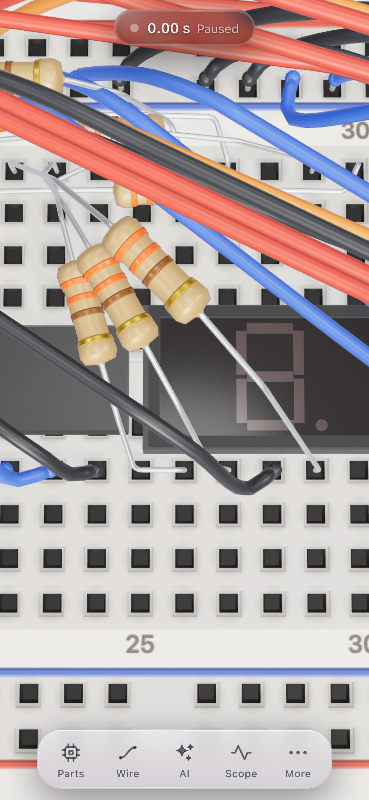
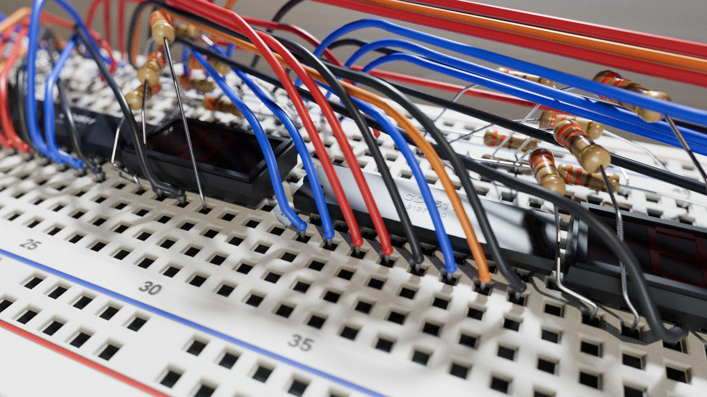
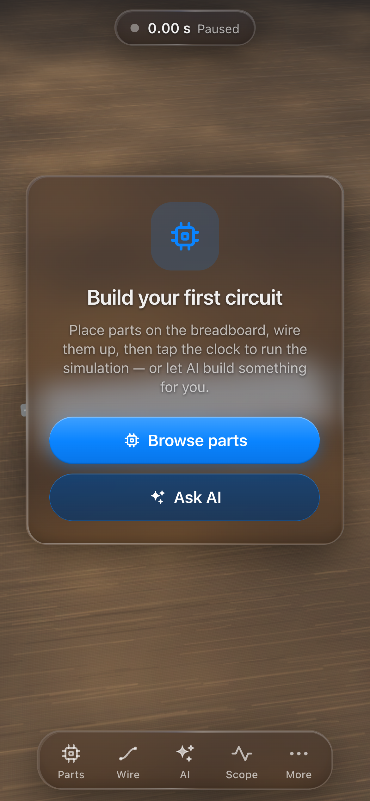
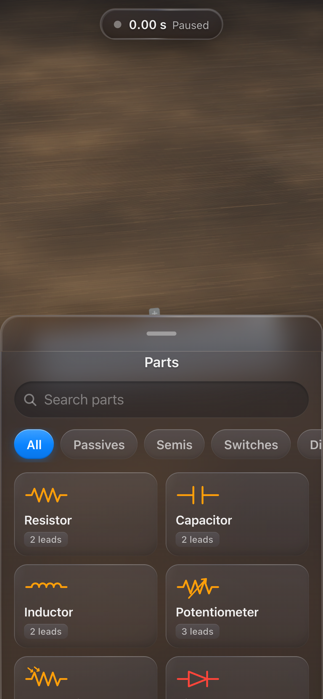
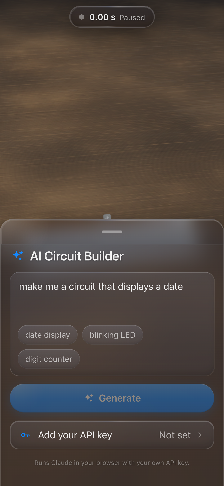
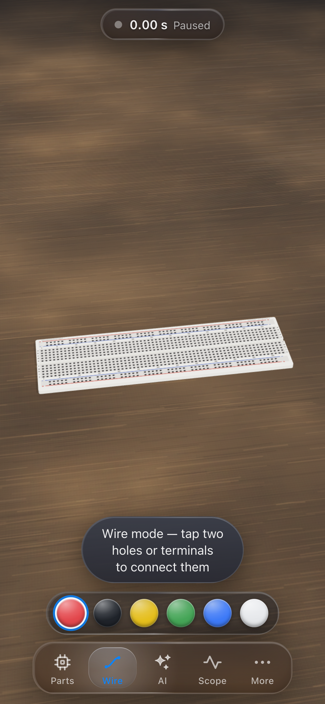
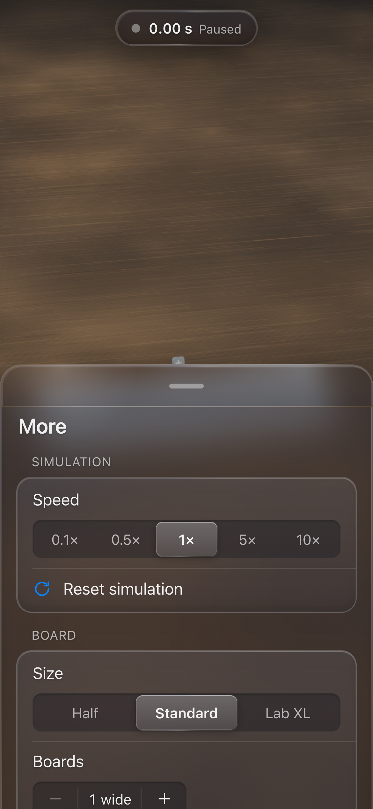
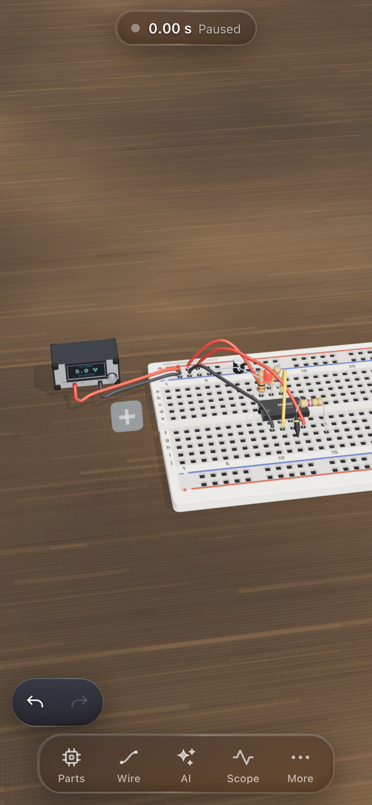
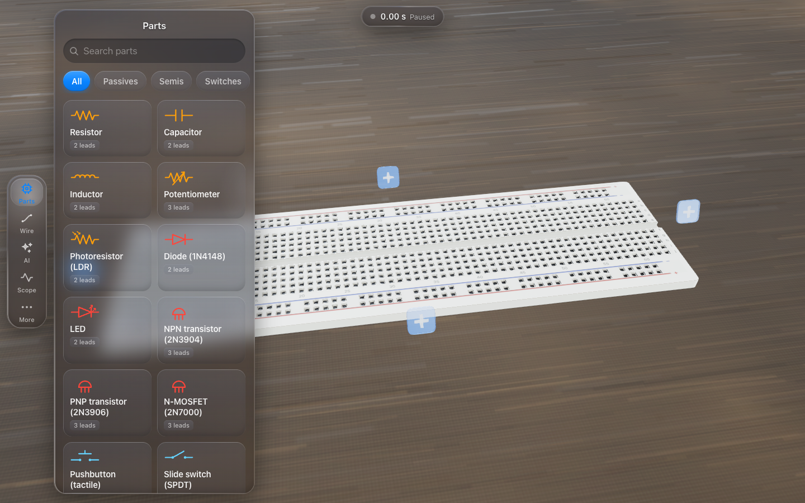

# ohmlet

**Hardware without the hardware.**

A Crumb-style **3D breadboard circuit simulator** that runs entirely in your
browser. Place real hardware components on a breadboard (three sizes, from a
400-point half board to a 1660-point Lab XL — and gang identical boards into
a **2-D bench grid up to six wide and four deep**), wire them up, and watch
them run in real time — a hybrid analog (modified nodal analysis) + digital
(behavioral IC) simulation with an oscilloscope, adjustable instruments, and
a Claude-powered "describe a circuit and it appears on the board" panel whose
circuits are **machine-tested in the simulator before you see them**.

By design there is **no microcontroller**: blinkers, counters, and even date
displays are built the old-fashioned way from 555 timers, ripple counters,
BCD decoders, and 7-segment displays.

- Vite + React 18 + TypeScript (strict)
- Three.js 3D scene (orbit camera, hole picking, procedural component meshes)
  with **three render modes** — the raster Performance pipeline, an HDRI +
  postprocessing Enhanced pipeline, and a progressive **path-traced Studio
  mode** for product-photo stills (see [Render modes](#render-modes))
- A reference-photo asset pass over the whole catalog: every part was
  compared against real product photography and reworked where it fell short
  — diffused-translucency LED epoxy, square 3296-style trimmer pots,
  brighter plated leads and instrument faceplates, recessed board hole
  sockets (no more raised collars), desaturated PVC wire insulation with
  stripped tips and lower resting arcs, and a lit walnut-laminate desk — and
  a dedicated harness renders each part full-frame for close-up review
- Smart collision-free routing for wires **and leaded components** — one
  deterministic planner routes everything around component bodies and each
  other (low "staple" jumpers for short hops, flat-topped arcs that dodge
  sideways before stacking upward for long runs); short resistor / diode /
  inductor spans **mount vertically**, body-on-end with a hairpin top lead,
  leaning apart deterministically when packed tight
- Custom MNA solver (Norton-only stamps, LU with partial pivoting,
  Newton-Raphson for nonlinear devices, backward-Euler reactives)
- Event-style behavioral chip models (74xx, CD4xxx, NE555, LM358)
- zustand store, `@anthropic-ai/sdk` for the AI panel, vitest for tests

## Run it

```sh
npm install
npm run dev        # http://localhost:5173 — Chrome gets the full glass lens
npm run test       # 546 tests
npm run build      # production bundle into dist/
```

## The interface

The UI is a **mobile-first, touch-native Liquid Glass design** in the
sense of Apple's WWDC 2025 material — not a frosted blur. Every chrome
surface (dock, sheets, capsules, cards) is a slab of a dynamic translucent
meta-material floating over the live 3D scene: the backdrop **visibly
bends and refracts around each surface's rounded perimeter** (per-tier SVG
displacement maps applied through `backdrop-filter`, baked once at
startup), a conic bent-light rim and inset shadows give the slab physical
thickness, a shared pointer-tracked **specular highlight** travels across
the glass (ambient drift on touch devices), pressed controls **gel** —
squash on touch-down while the specular blooms from the touch point, then
spring back with an overshoot — surfaces **morph** (FLIP transforms on the
house spring) instead of popping, and floating platters **sample the live
WebGL scene behind them** to adapt their tone, ink and shadow depth to the
backdrop's brightness. Surfaces are tiered (lens / rim+specular / static
glass) so at most 3 displacement lenses and 4 backdrop-filters are ever
live — the measured orbit budget holds with the worst chrome stack visible
(see [Performance](#performance)). All of it rides iOS-style spring motion
(one curve: `cubic-bezier(0.32, 0.72, 0, 1)`), press feedback on
touch-down, 44 px touch targets, safe-area awareness, and
`prefers-reduced-motion` / `prefers-reduced-transparency` support. The
material system lives in `src/ui/kit/glass/` and is specified in
[DESIGN.md §1](./DESIGN.md).

**Browser support matrix** (graceful ladder — the app is fully usable on
every rung):

| Engine / setting | Material you get |
|---|---|
| Chromium (Chrome, Edge, Android WebView) | full Liquid Glass: displacement lenses + saturated blur + bent-light rim + tracked specular + tone adaptation |
| Safari / Firefox | rich glass: 22px blur + 180% saturation + rim + specular + tone adaptation (no displacement — these engines drop the whole `backdrop-filter` declaration when it contains `url()`, so the lens is JS-gated to Chromium) |
| `prefers-reduced-transparency` | near-opaque slabs, no backdrop-filter, lens never arms |
| `prefers-reduced-motion` | no ambient sheen drift, no gel overshoot, morphs become crossfades; pointer-driven specular stays |



- **Status capsule** (top center) — run-state dot and sim clock. **Tap to
  Run/Pause**, **long-press to Reset** (a confirming second long-press
  guards against accidents). It expands briefly to surface simulation
  issues and AI progress, then auto-collapses.
- **Dock** (bottom) — five tabs: **Parts · Wire · AI · Scope · More**.
  Parts, AI and Scope open bottom sheets; **Wire** arms wire mode with a
  color-swatch strip above the dock (tap it again to exit); **More** holds
  sim speed, the **Graphics picker** (render mode), the **board-size
  picker** and the **Boards / Rows steppers** (grow the 2-D grid up to six
  wide × four deep), Reset, Import/Export, built-in examples, Clear board,
  and the API-key setting.
- **Placement & wiring previews** — the placement ghost is a **hologram of
  the actual part**: a light-blue translucent render with drifting scanlines
  and a fresnel rim (red when the spot is invalid), plus a glowing ring and
  light beam on every hole the legs will land in. With one lead hole picked,
  2-lead parts preview their **full routed pose** between the picked and
  hovered holes — vertical mounts included. While wiring, the preview tube
  follows the same collision-avoiding path the committed wire will take, and
  hovering any hole floats a tiny glass **coordinate chip** (`e23`,
  `top+5`) above it.
- **Bottom sheets** — the universal container: grabber handle, drag between
  peek / half / full snap points with rubber-banding, swipe down or tap the
  scrim to dismiss. Selecting a component auto-presents its **Properties**
  sheet (parameters, hole info, red Remove row).
- **Multi-select & group ops** — build a selection of several parts and
  wires: **shift/cmd-click** toggles a part in and out of the selection,
  **shift+drag** on empty board sweeps a marquee rectangle (desktop mouse),
  and on touch the long-press action sheet offers **Add to / Remove from
  Selection**. A multi-part selection shows a compact group pill (count +
  group delete); group deletes and group moves are each **one undo step**.
- **Move** — drag any selected part (or the whole selected group) to a new
  spot: a live hologram of the moving parts tracks the snap target, tinted
  cyan when the drop is valid and red when it is not. Validity is
  **all-or-nothing** across the group (bounds, seams, occupancy and body
  occlusion are checked with the movers' own old holes vacated); wires stay
  put and re-plug into the new holes. Desktop arrow keys nudge the selection
  one column / one strip-row step.
- **Rotation** — DIP and footprint packages rotate in quarter turns
  (clockwise in plan view). While placing, press **R** (or the ghost's
  rotate button) to spin the armed hologram — DIPs toggle 0↔180 (90/270
  would short every pin pair into one strip column), footprints step through
  all four. On a placed package, **R** (desktop) or long-press → **Rotate**
  steps to the next rotation whose holes validate — occupancy, occlusion and
  seams re-checked — as one undo step.
- **Body occlusion** — a part's molded body claims the holes it physically
  covers beyond its own pins (a potentiometer's wide body overhangs the
  neighboring row). The validator rejects pins and wire ends landing under a
  body, and tapping a covered hole pops a toast naming the covering part.
- **Movable instruments** — off-board instruments (power supply, function
  generator) sit on the bench around the board and can be **dragged to any
  free spot** (0.5-grid snap, validated clear of the boards and of each
  other; refusals snap back). Attached wires re-route to the new terminal
  positions on drop, and the position round-trips export/import.
- **Undo pill** — every document edit (placement, wiring, deletes, param
  changes, moves, rotations, instrument repositioning, board size / count /
  rows switches and grid growth, imports, AI applies) is one undoable step.
  A small glass pill with Undo/Redo buttons springs in above the dock on
  the left whenever a step is available and disappears when there is
  nothing to undo or redo.
- **Desktop ≥ 900 px** — same components, same glass: the dock becomes a
  left vertical rail and the sheets become floating side panels. Keyboard:
  **Space** = Run/Pause, **Esc** = dismiss/cancel, **Delete** = remove the
  selection, **R** = rotate (armed ghost or selected package), **arrow
  keys** = nudge the selection, **Cmd/Ctrl+Z** = undo,
  **Cmd/Ctrl+Shift+Z** (or **Ctrl+Y**) = redo.

### Render modes

Three render modes, switchable live from the **More** sheet's Graphics
picker (persisted in `localStorage['bb.renderMode']`; the device default is
**Performance** on phones and **Enhanced** on desktop):

| Mode | Pipeline | Cost |
|---|---|---|
| **Performance** | the classic raster path: room-environment IBL, ACES tone mapping, one on-demand 2048 shadow map | zero added — best battery life |
| **Enhanced** | studio HDRI image-based lighting + an EffectComposer stack: SAO ambient occlusion, subtle HDR-threshold bloom (only emitters bloom), SMAA anti-aliasing; 4096 shadow map on desktop (still exactly one, on-demand) | a few fullscreen passes |
| **Studio** | progressive **GPU path tracing** of the same scene graph for product-photo stills | GPU-bound while converging, then holds the still |

**How Studio works.** While the camera is idle, the path tracer accumulates
samples progressively (a progress readout counts samples per pixel) and the
image refines into a physically lit still — real soft shadows, color
bleeding, depth of field from a physical-camera model focused on the parts,
and a fine photographic grain that freezes when the still is held. The
moment you orbit, drag or edit, the scene drops back to the Enhanced raster
pipeline so interaction stays at full frame rate, then re-converges when
things settle; placement holograms, hover rings and selection boxes are
composited live **on top of** the held still, so editing never waits for
the renderer. BVH builds run on a Web Worker when available. Expect tens of
seconds to converge on a desktop GPU (longer on dense multi-board scenes,
minutes on phones) — Studio is for screenshots and beauty shots, not for
watching a running sim (telemetry restarts the accumulation).

Both Enhanced and Studio are **lazy-loaded chunks** — Performance users
never download the HDRI, the composer passes or the path tracer (a test
guards this). Unsupported devices fall back down the ladder automatically.

Credits: path tracing by
[`three-gpu-pathtracer`](https://github.com/gkjohnson/three-gpu-pathtracer)
(Garrett Johnson) with
[`three-mesh-bvh`](https://github.com/gkjohnson/three-mesh-bvh); studio
lighting HDRI [`studio_small_03`](https://polyhaven.com/a/studio_small_03)
by Sergej Majboroda via [Poly Haven](https://polyhaven.com/) (CC0). Engine
details, version pinning rationale and material caveats live in
[`src/three/render-modes/RENDER-MODES.md`](./src/three/render-modes/RENDER-MODES.md).



### Board sizes & the 2-D board grid

Three board presets, switchable any time from the **More** sheet (one
undoable step):

| Preset | Columns | Rail holes per rail | Tie points |
|---|---|---|---|
| Half | 30 | 25 | 400 |
| Standard | 63 | 50 | 830 |
| Lab XL | 126 | 100 | 1660 |

Identical boards gang into a **2-D bench grid**: up to **six modules wide**
(side by side, like bench-mounted lab stations) by up to **four board-rows
deep** (front to back, like separate breadboards on a bench). Two ways to
grow:

- the **Boards / Rows steppers** in the More sheet (next to the size
  picker, with a live tie-point/column readout), and
- the **"+" grow paddles** rendered in 3D at the four edges of the grid
  (visible in select mode while the sim is stopped, until each axis hits
  its cap) — tap one and the new module or row springs in. Growing **left**
  or **up** keeps the circuit in place relative to the new top-left origin
  (every hole reference is remapped automatically, as one undo step).

Tap a paddle and the new module or board-row **drops in from above** — a
gravity ease-in fall that levels out of a slight tilt, a one-beat
squash-and-settle on the house spring, and a subliminal dust puff at
touchdown (~650 ms) before the camera glides home to frame the bigger rig.
The paddles also hide the quiet **removal** affordance, on the two edges
that can shrink (the rightmost module column, the deepest board-row):
hovering a "+" paddle (desktop) reveals a small **"−" chip** beneath it —
tap the chip — while on touch a **long-press** on the paddle fires the same
removal directly. The removed boards **lift and fade away** with a smaller
puff; if any lead or wire end would be stranded the removal is refused with
a toast instead.
With `prefers-reduced-motion`, both animations collapse to a simple fade.

**Across a row (modules), numbering is continuous:** columns and rail
indices run straight across — board 2 of a Standard rig starts at column
64, and `top+50` is the first top-rail hole of its second module. Each of
the four power rails stays **one continuous bused net** along the entire
row. The one extra physical rule is the **seam rule**: a rigid DIP or
footprint package cannot straddle the gap between two modules (the
validator and placement ghost both refuse it); wires and flexible-lead
parts cross seams freely.

**Between board-rows, boards are independent:** the front row keeps the
bare hole references (`a12`, `top+5`) and deeper rows take a 0-indexed
prefix (`1:a12`, `2:top+5`, `3:j63`). Rails on different board-rows are
**separate nets** — jumper power between rows exactly as you would on a
real bench — and no rigid package can span the seam between rows (wires
cross freely).

Growing — more modules, more rows, or a bigger preset — keeps every part
exactly where it is. Removing boards or shrinking the preset is refused
(with a toast counting the stranded parts) whenever a lead or wire endpoint
would land off the smaller rig; switching the preset of a multi-board rig
is also refused when the moved seams would cut through a package. Circuit
JSON carries optional `"board"` (`"half" | "standard" | "labxl"`; absent
means `"standard"`), `"boardCount"` (1–6 modules wide; absent means 1) and
`"boardRows"` (1–4 rows deep; absent means 1) fields, and the AI is told
the active rig — it may pick a larger one when your request needs the
room.

### Gestures (3D canvas)

| Gesture | Action |
|---|---|
| 1-finger drag | Orbit the camera |
| 2-finger drag / pinch | Pan and zoom |
| Tap | Place a lead / wire endpoint, or select a component (hole snap radius widens for touch, with a ghost-cursor ring above the fingertip) |
| Drag a selected part / instrument | Move it (camera orbit is suspended; hologram shows the drop) |
| Shift+drag empty board (mouse) | Marquee multi-select |
| Long-press a component | Action sheet: Properties / Rotate (packages) / Duplicate / Add to Selection / Delete |
| Double-tap empty space | Re-frame the camera on the circuit |

### Install to your home screen

ohmlet ships PWA metadata (web manifest, standalone display,
dark theme-color, apple-touch-icon). On iOS Safari use **Share → Add to
Home Screen** for a full-screen, no-browser-chrome app that respects the
notch and home indicator; on Android/desktop Chrome use the install action
in the address bar. Note: in the iOS standalone app, file **Export** falls
back to copying the circuit JSON to the clipboard.

### Screenshots

| | |
|---|---|
|  |  |
|  |  |
|  |  |



Screenshots in [`shots/`](./shots) are regenerated by the Playwright
harnesses (playwright is a devDependency only):

```sh
npm run build
node scripts/screenshot.mjs        # phone 390×844 @3x touch + desktop 1440×900 → shots/*.png
node scripts/screenshot-boards.mjs # board-size close-ups → shots/board-*.png
node scripts/closeups.mjs          # close-up of EVERY catalog part + contact sheets → shots/closeup-*.png
node scripts/sweeps.mjs            # functional sweep (self-asserting) → shots/sweep-*.png
node scripts/modes.mjs             # the three render modes incl. converged Studio stills → shots/modes-*.png
node scripts/glass-chrome.mjs      # Liquid Glass chrome audit (filter/lens budget asserts + perf) → shots/glassf-*.png
node scripts/glass-hero.mjs        # the Liquid Glass signature shot → shots/liquid-glass-hero.png
```

`closeups.mjs` is the close-up quality gate: it script-generates a showcase
layout containing every component type, frames each part full-screen, and
stitches contact-sheet grids for review. `sweeps.mjs` self-asserts the
interaction flows (placement on board 3 of a rig, wiring across a seam, rig
save/load round-trip, undo/redo across a paddle growth, valid/invalid
holograms, routed preview vs committed wire, grid growth in all four
directions, drag-to-move + marquee group moves, DIP rotation before and
after placement, PSU wire exits, occlusion feedback) and exits non-zero on
failure. `modes.mjs`
captures the same scene in all three render modes — waiting for full Studio
convergence — proves the live-overlay-over-held-still compositing, and
asserts at the network level that the path-tracer chunk is never downloaded
outside Studio. `shots/studio-hero.png` is the kept converged Studio beauty
still.

## Quick start

```sh
npm install
npm run dev        # open the printed localhost URL
```

Other scripts:

```sh
npm run build      # production build to dist/
npm run preview    # serve the production build
npm run typecheck  # tsc --noEmit
npm test           # vitest run
```

Basic flow: pick a part from the **Parts** sheet, tap holes to place its
leads (DIP chips anchor pin 1 on row `f` and straddle the center channel),
arm the **Wire** tab to connect holes and rails, add an off-board power
supply and wire `PS1:+` / `PS1:-` to the rails, then tap the status capsule
to run. Select a component to edit its parameters in the Properties sheet;
runtime parameters (pot position, switch state, light level, supply
voltage…) can be tweaked while the simulation runs. Drop `scope_probe`
components on nets to plot them in the **Scope** sheet.

## Setting your Anthropic API key

The AI Circuit Builder calls Claude (**model `claude-opus-4-8`**) directly
from your browser.

1. Open the **AI** tab (or **More** tab) in the dock and tap
   **Add your API key**.
2. Paste your Anthropic API key and save.

The key is stored only in your browser's localStorage (`bb.apiKey`) and is
sent **only to `api.anthropic.com`** — there is no backend server, and the
key never touches anything else. You can create a key at
<https://console.anthropic.com/>.

## The AI prompt panel

Open the AI panel, describe the circuit you want, and Claude returns a
complete layout that is placed on the board along with a short explanation.

Generation is **self-verified: circuits are machine-tested in the simulator
before you see them.** The model declares testable expectations alongside
the layout (LED on/off/blinking at a rate, digits a display should show,
nets that should oscillate or sit in a voltage range, buzzer sounding…);
the pipeline validates the layout, then builds it in the real `SimEngine`
(in a background worker, so the UI never freezes) and checks every
expectation plus always-on health checks (burned LEDs, shorts, unpowered
chips, solver trouble). Failures — with the measured data embedded — go
back to the model as repair turns (up to three rounds, shared with
validation repairs). The result card shows a green **"✓ Tested in
simulation"** badge listing exactly what passed before you Apply. Example
prompts:

- "make me a circuit that displays a date"
- "a 555 blinking an LED at about 2 Hz"
- "a night light: LED turns on when it gets dark, using an LDR and a transistor"
- "a 0–9 counter on a 7-segment display with a reset button"
- "chase 10 LEDs in a circle"

The system prompt is generated from the component catalog (pin tables and
usage docs), so the model only uses parts the simulator actually supports.

## Import / export format

Circuits are plain JSON (`version: 1`) — the same DSL is used for file
import/export, autosave, and LLM output. The full specification (hole
reference syntax like `"a12"` / `"top+5"` / `"PS1:+"`, the DIP placement
rule, geometry and net rules) lives in
[ARCHITECTURE.md](./ARCHITECTURE.md) — see "The DSL" and "Breadboard
geometry" sections. The importer runs the same validator as the AI pipeline,
so malformed layouts are rejected with specific errors.

## Examples

The [`examples/`](./examples) folder contains curated circuits:

| File | Circuit |
|---|---|
| `blinky-555.json` | 555 LED blinker (~1.5 Hz) |
| `night-light.json` | Automatic night light (LDR + transistor) |
| `counter.json` | 0–9 counter with 7-segment display and reset button |
| `date-display.json` | Hardware date display — "0611" from hardwired BCD decoders |

All four are built into the app — **More** tab → Examples — and can also be
loaded from file via **More → Import** (choose the `.json` file or paste its
contents). All examples pass the validator and are simulated in the test
suite.

## Component library

Generated from `src/model/catalog.ts` (the `type` column is what you use in
JSON imports and what the LLM emits).

### Passives

| Type | Label | Placement | Pins | Key params |
|---|---|---|---|---|
| `resistor` | Resistor | leads | p1, p2 | resistance (Ω) |
| `capacitor` | Capacitor | leads | p1, p2 | capacitance (F), polarized |
| `inductor` | Inductor | leads | p1, p2 | inductance (H) |
| `potentiometer` | Potentiometer | leads | ccw, wiper, cw | resistance (Ω), position (runtime) |
| `photoresistor` | Photoresistor (LDR) | leads | p1, p2 | light 0–1 (runtime) |

### Semiconductors

| Type | Label | Placement | Pins | Key params |
|---|---|---|---|---|
| `diode` | Diode (1N4148) | leads | anode, cathode | — |
| `led` | LED | leads | anode, cathode | color (red/green/yellow/blue/white) |
| `npn` | NPN transistor (2N3904) | leads | emitter, base, collector | — |
| `pnp` | PNP transistor (2N3906) | leads | emitter, base, collector | — |
| `nmos` | N-MOSFET (2N7000) | leads | source, gate, drain | — |

### Switches

| Type | Label | Placement | Pins | Key params |
|---|---|---|---|---|
| `pushbutton` | Pushbutton (tactile) | footprint (straddles channel) | A1, A2, B1, B2 | pressed (runtime) |
| `slide_switch` | Slide switch (SPDT) | leads | a, common, b | state a/b (runtime) |
| `dip_switch_8` | DIP switch ×8 | DIP-16 | 1A–8A, 8B–1B | on bitmask (runtime) |

### Power & sources (off-board)

| Type | Label | Placement | Terminals | Key params |
|---|---|---|---|---|
| `power_supply` | DC power supply | off-board | `ID:+`, `ID:-` | voltage 0–15 V (runtime) |
| `function_generator` | Function generator | off-board | `ID:out`, `ID:gnd` | waveform, frequency, amplitude, offset (runtime) |

### Displays & output

| Type | Label | Placement | Pins | Notes |
|---|---|---|---|---|
| `seven_segment` | 7-segment display | DIP-10 | E, D, COM1, C, DP, B, A, COM2, F, G | common-cathode; use series resistors |
| `buzzer` | Buzzer | leads | p1, p2 | sounds above ~1 V |

### ICs

| Type | Label | Package | Description |
|---|---|---|---|
| `ne555` | NE555 timer | DIP-8 | astable/monostable timer, f ≈ 1.44/((R_A+2R_B)·C) |
| `lm358` | LM358 dual op-amp | DIP-8 | single-supply op-amp / comparator |
| `sn7400` | 7400 quad NAND | DIP-14 | four 2-input NAND gates |
| `sn7404` | 7404 hex inverter | DIP-14 | six inverters |
| `sn7408` | 7408 quad AND | DIP-14 | four 2-input AND gates |
| `sn7432` | 7432 quad OR | DIP-14 | four 2-input OR gates |
| `sn7486` | 7486 quad XOR | DIP-14 | four 2-input XOR gates |
| `sn7474` | 7474 dual D flip-flop | DIP-14 | rising-edge D-FF with async PRE/CLR |
| `cd4017` | CD4017 decade counter | DIP-16 | one-of-ten outputs, LED chasers |
| `cd4026` | CD4026 counter + 7-seg driver | DIP-16 | decade counter with direct segment outputs |
| `cd4511` | CD4511 BCD→7-seg latch/decoder | DIP-16 | drives common-cathode displays |
| `sn74193` | 74193 4-bit up/down counter | DIP-16 | presettable binary up/down counter |
| `cd4040` | CD4040 12-bit ripple counter | DIP-16 | falling-edge clock divider chain |

### Instruments

| Type | Label | Placement | Pins | Key params |
|---|---|---|---|---|
| `scope_probe` | Oscilloscope probe | single hole | tip | channel 1–4 |

## Limitations (by design)

- **No microcontroller.** Counters, clocks, and date displays are built from
  discrete logic — that is the point.
- **Simplified analog models.** Diodes/LEDs are Shockley junctions, BJTs are
  Ebers-Moll (β = 150), the MOSFET is a square-law device; chips are
  behavioral models with Norton output stamps, not transistor-level netlists.
- **Floating inputs read low.** An unconnected chip input is treated as 0 V
  (logic LOW). Real TTL inputs float HIGH — always tie unused inputs.

## Performance

Phase D optimized all three render modes for frame rate while keeping the
approved look pixel-for-pixel (every change re-passed the close-up and
render-mode harnesses). What changed:

- **Scene (all modes):** each wire is merged into one mesh and repeated
  parts share batched/merged statics (draw calls on the reference circuit:
  Performance **526 → 316**, Enhanced **1069 → 527**);
  `matrixAutoUpdate` is off for static subtrees (matrices set once at
  build/move-commit); hover raycasts are gated off while the orbit gesture
  is in flight; first-use shaders are pre-warmed at mount, so the
  first-drag hitch (a 116 ms frame at baseline) is gone.
- **Enhanced:** SAO runs at **half resolution** (identical world-space AO
  footprint, bilinear-upsampled composite) and its normal/depth pre-pass
  skips a cached list of meshes that cannot affect AO — the SAO surcharge
  dropped from ~525 extra draws/frame to ~191. Bloom/SMAA unchanged; still
  exactly one on-demand shadow map (4096 desktop / 2048 phone).
- **Studio:** internal trace resolution is clamped to a **~2.6 MP pixel
  budget** (a 5.2 MP retina canvas traces at ~0.71× — converged-still A/B
  passed the look gate — which also eliminated a reproducible GPU-process
  crash at retina); per-rAF tile bursts are capped at 180 k px with a finer
  restart ladder, so re-convergence after a camera settle dropped from
  82 fps / 26 jank frames to ~108 fps / 3–6. Orbiting in Studio is exactly
  the Enhanced fallback (same draws, zero mid-orbit BVH rebuilds).

Measured at the final gate (`scripts/perf.mjs`: date-display example — 37
parts / 42 wires — 8 s programmatic 360° orbit, headed Chromium on an Apple
M4 Pro with a **120 Hz display, so 120 fps = the vsync cap**; before =
Phase-D baseline, after = final build, median of repeats; phone rows are
viewport/DPR/touch emulation on the same machine):

| run | viewport | avg FPS before → after | p95 ms before → after |
|---|---|---|---|
| desktop-performance | 1440×900 @2x | 119.9 → **120** | 9.7 → **8.5** |
| desktop-enhanced | 1440×900 @2x | **74.9 → 120** | **17.7 → 8.4** |
| desktop-studio (orbit = Enhanced fallback) | 1440×900 @1x | 119.8 → **119.9** | 10.1 → **8.4** |
| phone-performance (touch) | 390×844 @3x | 119.9 → **120** | 9.7 → **8.4** |
| phone-enhanced (touch) | 390×844 @3x | 120 → **120** | 9.8 → **8.4** |
| phone-studio (touch) | 390×844 @3x | 119.8 → **120** | 9.8 → **8.4** |

Desktop Studio at retina @2x converges in real Chrome (76 s, 320 samples;
`perf/studio2x-chrome.md`) — the playwright-bundled Chromium still kills its
own GPU process on that one config, so the gate row uses @1x (converged 2/2).
At baseline desktop-enhanced ran at 74.9 fps with a 33 ms p95 worst-1% and
mid-orbit shader-compile hitches; at the gate every mode orbits **at the
vsync cap with zero frames over 33 ms**, and per-frame allocation is down
37–70 % per mode. Full artifacts (with dist-hash provenance, repeat spreads
and pass-cost attribution): [`perf/`](./perf), headline analysis in
`perf/final.md` and `perf/hotspots.md`; budgets in
[DESIGN.md §7](./DESIGN.md).

## Known issues

Minor findings from the Phase-F (Liquid Glass) final-gate review — unfixed
minors and verification records. None block typical use: `tsc --noEmit` is
clean, the full test suite (**546 tests**) passes, the build is green, the
perf probe was re-run at the final gate with the glass chrome visible
(desktop-enhanced orbits at the 120 fps vsync cap, p95 8.8 ms), and the
screenshot sweep was re-shot fresh against the final build.

- Desktop rail and panels stretch lens maps 4–8× past the documented ±25%
  tolerance; panel bottom corners use a square-cornered map.
- On touch devices the specular sheen sticks at full energy after every
  tap.
- Edge lensing is nearly invisible in the app's default framing (chrome
  floats over the featureless desk).
- Segmented control items (36px) and stepper buttons (47×36) sit below the
  44px acceptance bar with no hit expansion.
- Grabbing a sheet during the 360ms morph-present re-bases drag position
  from the FLIP-displaced transform.
- DESIGN.md's "tracked-specular registrations stay small (≤~5 concurrent)"
  undercounts the shipped registrations.
- Lens arms up to ~300ms after first paint, visibly swapping the chrome's
  material once.
- Verified honest (positive findings): perf numbers reproduce with surfaces
  visible at Phase-D levels; a11y fallbacks complete; sheet
  physics/keyboard avoidance intact; fallback material stands on its own.

Phase-E (final polish) findings carried forward: dust is excluded from
Studio stills but never composited raster-side, contradicting its own doc
comment; minus-chip reveal and paddle hover springs are frame-rate
dependent; multi-row rigs print a spurious half seam line on the outer
front/back edges; desk visible through a small slot where module seams
cross the center channel; stale pendingGrowDir after a store-refused
paddle tap can misattribute a later rebuild's spawn animation; build
nondeterminism breaks dist-hash provenance; no VCS to audit deltas between
review passes.

## Architecture

See [ARCHITECTURE.md](./ARCHITECTURE.md) for the full system design: the
coordinate system, net model, solver, chip bridge API, scene contract, and
module ownership map.
